# Personode

Personode is a toolbox written in MATLAB designed to make the identification of fMRI spatial independent component analysis (ICA) components into resting-state networks (RSNs) easier.

## Requirements

 - MATLAB R2013A or newer
 - SPM12 (get at https://www.fil.ion.ucl.ac.uk/spm/software/spm12/)
 - MarsBaR (`marsbar-0.44.zip` is included. Alternatively, get at http://marsbar.sourceforge.net/)

## A Quick Intro

 - Download the compressed file (get at https://www.nitrc.org/projects/personode) and extract it in a folder of your preference or clone this repository to your desktop.
 - Set Personode's path to Matlab. Make sure that both SPM12 and MarsBaR paths are also included (do not include "spm2", "spm5", and "spm99" contained in MarsBaR folder).
 - Type Personode in Matlab's command window. The following GUI will show up:

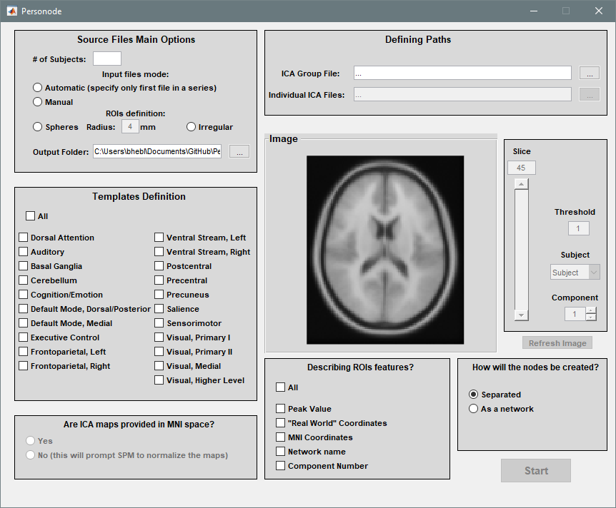

 - In "Source Files Main Options":
	- Specify the number of subjects;
	- In "Input files mode", if "Automatic" is selected, only ICA file from first subject will be required. If "Manual" is selected, one needs to manually select subjects' files for analysis;
	- There are two modes of ROIs definition: spherical ROIs (radius can be altered) and probabilistic irregular ROIs. Select one of them;
	- Specify the output folder.
- In "Defining Paths", ICA spatial component files must be loaded. GIFT toolbox (download at http://mialab.mrn.org/software/gift/) for Matlab can be used to create the components.
- In "Templates Definition", choose the resting-state network(s) you would like to identify.
- In "Are ICA maps coregistered" answer yes if the images already have MNI dimensions. Answer no if you want the toolbox to perform coregistration for you (in this case, you need also to specify an MNI-normalized anatomical file in a forthcoming SPM window).
	- If the images are already of the right dimensions, you can navigate through the components using the GUI buttons (slice, threshold, subject, component, refresh image) 
- In "Describing ROI features" select the information that you would like to obtain from the ROI definition process. 
- In "How will the nodes be created", select either "Separated" for creating a mask with an atlas labeling (integer numbers as labels) or "As a network" as a binary mask for networks.
- Press Start.
- A Manual selection window will appear showing, in the left side, the resting-state network template you want to identify and the three most probable components to be classified. You can navigate using xyz buttons. Probability values are also shown to help with the classification. One can select a component and then press Next. If more than one RSN was selected to be identified, one can also skip the current component to be defined later.
- Nifti masks and TXT info files will be saved in the specified output folder.

## Example using coregistered images

 - We will begin this example using the images included in the folder `Personode\Images_example\Coregistered images`
 - `rica_mean_coment_ica_s_all_.nii` is the result of a group ICA with 20 components.
 - `rica_sub001_component_ica_s1_.nii` and `rica_sub002_component_ica_s1_.nii` are the resulting subject-level components for two subjects.
 - Thus, set `# of Subjects` to 2, set your preferred output folder and options. An example is shown below.

 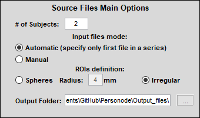

 - Then fill in the `ICA Group File` and `Individual ICA Files` paths. If you picked `Automatic` input file naming previously, you only have to select the ICA map for the first subject.
 - Select your networks of interest in `Templates Definition`. 

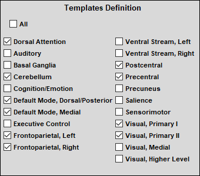

 - Since our ICA maps are coregistered, select yes.

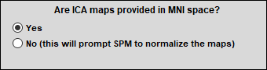

 - After selecting this, the image interface will be unlocked. You can freely explore the spatial components of the group or the subjects individually.

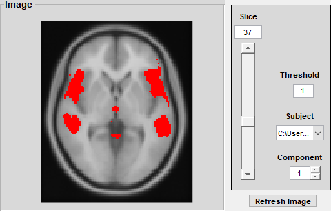

 - Finally, select your `Describing ROIs features` of interest, and the way you want the nodes to be created. Here you have two options: `Separated` or `As a network`. Filling this information will unlock the `Start` button.

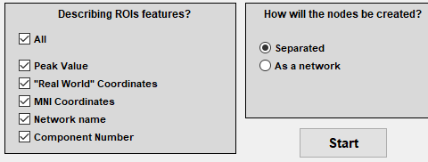 

 - Clicking this button will show this message on the console

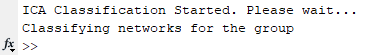 

 - Shortly after, you are going to be prompted to make selections regarding the component classification as resting-state networks. You can skip a network at any time, later you will be asked again about the skipped ones.

 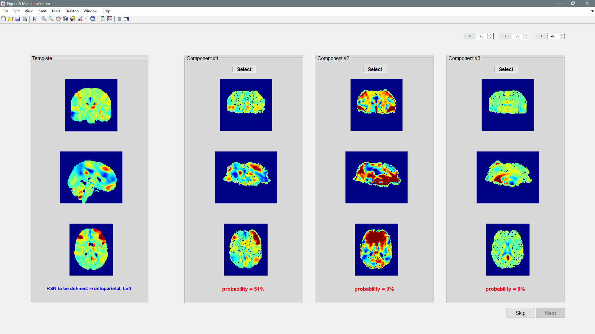 

 - Personode will then position the nodes for the group and each subject

 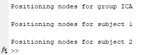 

 - In the selected output folder, node definitions, i.e. ROIs masks, will appear for all inputs

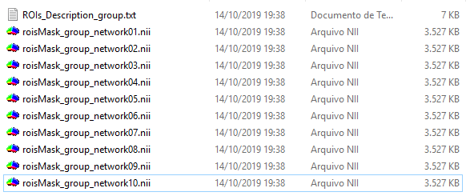 

 - Also included is the respective `ROIs_Description_*.txt` for each input, an example is shown below.

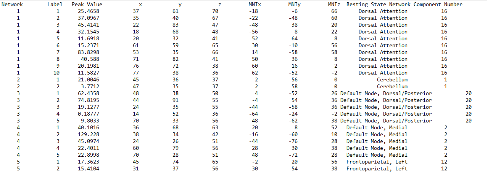 

# References

 - \[MarsBaR\] Matthew Brett, Jean-Luc Anton, Romain Valabregue, Jean-Baptiste Poline. _Region of interest analysis using an SPM toolbox_ \[abstract\] Presented at the 8th International Conference on Functional Mapping of the Human Brain, June 2-6, 2002, Sendai, Japan. Available on CD-ROM in NeuroImage, Vol 16, No 2.
 - \[SPM12\] Penny, W. D., Friston, K. J., Ashburner, J. T., Kiebel, S. J., & Nichols, T. E. (Eds.). (2007). Statistical parametric mapping: the analysis of functional brain images.
